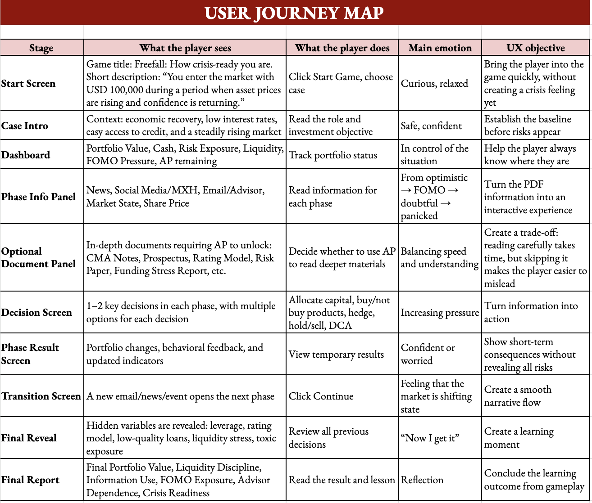
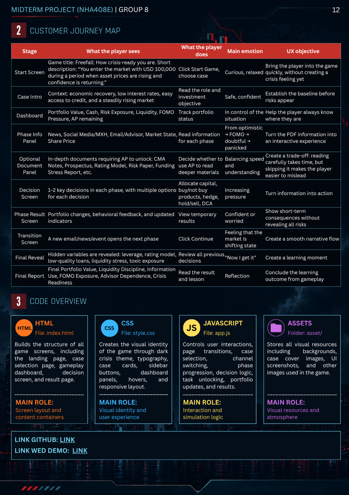
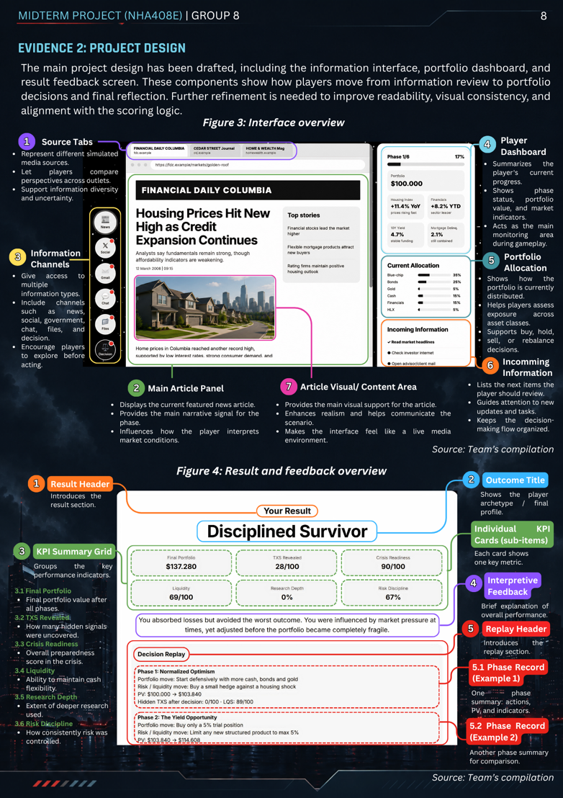
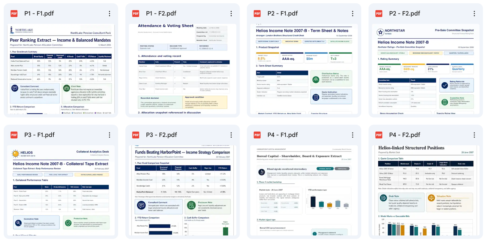
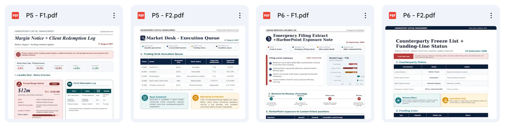

# INDIVIDUAL FOOTPRINT

**Thành viên: Nguyễn Châu Anh**

**Mã sinh viên: 2313380003**

## 1. Vai trò trong dự án

Trong dự án này, em phụ trách phần **Gameplay Flow & Player Experience**. Nói đơn giản, phần việc của em là thiết kế cách người chơi đi qua toàn bộ game: bắt đầu từ màn hình giới thiệu, chọn case, đọc thông tin theo từng phase, mở các file hỗ trợ, đưa ra quyết định, xem kết quả từng phase và cuối cùng là nhận final report.

Ngoài phần flow, em cũng tham gia xây dựng các **file thông tin trong mục File của game**. Đây là những tài liệu hỗ trợ người chơi ra quyết định, ví dụ như research note, technical appendix, product term sheet, liquidity report, funding stress brief và một số tài liệu mô phỏng khác. Các file này cung cấp thêm dữ liệu và bằng chứng sâu hơn để người chơi có cơ sở cân nhắc trước khi chọn hành động.

## 2. Đóng góp cá nhân vào sản phẩm cuối cùng

Đóng góp rõ nhất của em nằm ở hai phần: **luồng trải nghiệm người chơi** và **các file hỗ trợ decision-making**.

Với phần gameplay flow, em xây dựng trình tự trải nghiệm của người chơi theo các bước: Start Screen → Case Intro → Dashboard → Phase Information → Optional Documents/File → Decision Screen → Phase Result → Transition Event → Final Reveal → Final Report.

Với phần File trong game, em hỗ trợ tạo các tài liệu evidence layer để người chơi có thể mở ra đọc trước khi ra quyết định. Những file này không chỉ để làm game nhìn đầy đủ hơn, mà còn cung cấp dữ liệu thị trường, tín hiệu rủi ro, bối cảnh tài chính và các thông tin chuyên sâu giúp người chơi đánh giá lựa chọn của mình kỹ hơn.

## 3. Những phần em đã thực hiện

Trong quá trình làm dự án, em đã tham gia vào các phần sau:

- Thiết kế player journey map cho toàn bộ game.

- Thiết kế screen flow cho các màn hình chính.

- Xây dựng nhiệm vụ của người chơi theo từng phase, để mỗi giai đoạn trong game đều có mục tiêu rõ ràng.

- Thiết kế cách chuyển tiếp giữa các phase, giúp người chơi cảm nhận được thị trường đang thay đổi dần từ trạng thái ổn định, sang cơ hội mới, FOMO, tín hiệu trái chiều, market stress và cuối cùng là crash.

- Viết nội dung mô tả cho một số phần như dashboard, phase information, decision screen, result screen và final report.

- Tham gia xây dựng các tài liệu trong mục File của game như research note, technical appendix, product term sheet, liquidity report, funding stress brief và systemic exposure appendix để hỗ trợ người chơi ra quyết định theo từng phase.

- Chỉnh sửa nội dung và layout PDF bằng bảng biểu, chart, indicator và warning box phù hợp với từng loại tài liệu; đồng thời phân biệt file cảnh báo mạnh và file thông tin nền để game không reveal khủng hoảng quá sớm.

<!-- -->

- Phối hợp với các thành viên khác để phần nội dung, giao diện và decision logic khớp với nhau hơn.

- Em còn góp phần thiết kế phần project design và phần công việc của bản thân trong báo cáo giữa kỳ.

## 4. Các file, tính năng, dữ liệu, giao diện hoặc phần demo em đã đóng góp

Các phần em đóng góp bao gồm:

- User journey map cho gameplay.

- Gameplay flow.

- Bảng player task theo từng phase.

- Mô tả trải nghiệm người chơi ở từng giai đoạn.

- Nội dung chuyển tiếp giữa các phase.

- Phần giải thích cho dashboard và final report.

- Các file PDF trong mục File của game.

- Chart, bảng indicator, warning box và nội dung hỗ trợ decision-making trong các file PDF.

- Gợi ý cách trình bày từng loại file sao cho đúng cảm giác của một tài liệu tài chính, ví dụ như research note, technical appendix, product term sheet hoặc crisis note.

## 5. Phần đóng góp của em kết nối với sản phẩm cuối cùng như thế nào

Phần việc của em giúp sản phẩm không chỉ dừng lại ở một case study để đọc, mà trở thành một **crisis simulation game** có trải nghiệm rõ ràng hơn.

Gameplay flow giúp người chơi biết mình đang ở phase nào, cần đọc thông tin gì, có thể mở file nào và đến lúc nào thì phải đưa ra quyết định. Các file trong mục File giúp người chơi có thêm bằng chứng trước khi chọn option. Nhờ vậy, quyết định trong game không bị cảm giác ngẫu nhiên, mà gắn với những thông tin người chơi đã đọc và phân tích.

Các file evidence layer cũng làm game thực tế hơn. Người chơi có thể ra quyết định nhanh chỉ dựa trên news, social posts, emails và chats, hoặc dành thêm thời gian để đọc các tài liệu sâu hơn trong mục File. Điều này khá giống với bối cảnh tài chính thực tế, khi người ra quyết định phải xử lý nhiều nguồn thông tin khác nhau trong điều kiện áp lực và không chắc chắn.

## 6. Bằng chứng đóng góp

Các bằng chứng có thể kiểm tra bao gồm:

**Hình 1.** User journey map.

**Hình 2,3** Báo cáo giữa kì

**Hình 4,5.** Các file PDF trong mục File của game, có chart, bảng indicator và nội dung hỗ trợ decision-making.

| **Phase** | **Bối cảnh thị trường** | **Nhiệm vụ của người chơi**                                                                                     | **Mục đích trải nghiệm**                                                                                                                   |
|-----------|-------------------------|-----------------------------------------------------------------------------------------------------------------|--------------------------------------------------------------------------------------------------------------------------------------------|
| Phase 1   | Normal Market           | Đọc thông tin thị trường ban đầu, theo dõi chỉ số danh mục và đưa ra quyết định phân bổ đầu tiên.               | Giúp người chơi hiểu trạng thái nền của thị trường và bắt đầu cảm nhận áp lực từ việc giữ vị thế thận trọng.                               |
| Phase 2   | New Opportunity         | Xem xét cơ hội đầu tư mới, đọc file hỗ trợ như term sheet và cân nhắc có tăng exposure hay không.               | Tạo tình huống người chơi phải cân bằng giữa lợi suất hấp dẫn và các điều kiện rủi ro nằm trong tài liệu.                                  |
| Phase 3   | Boom & FOMO             | So sánh thông tin từ news, social, chat và file để quyết định tiếp tục tăng rủi ro hay giữ kỷ luật.             | Làm người chơi cảm nhận áp lực chạy theo thị trường và học cách nhận diện tín hiệu rủi ro sớm.                                             |
| Phase 4   | Mixed Signals           | Đọc các nguồn thông tin mâu thuẫn, kiểm tra file chuyên sâu và đánh giá lại mức độ rủi ro của danh mục.         | Giúp người chơi hiểu rằng khủng hoảng không xuất hiện rõ ràng ngay lập tức mà thường bắt đầu bằng các tín hiệu không đồng nhất.            |
| Phase 5   | Market Stress           | Ưu tiên kiểm tra thanh khoản, nhu cầu tiền mặt và khả năng bán tài sản trước khi ra quyết định.                 | Đưa người chơi vào tình huống phải xử lý áp lực vận hành và ra quyết định dưới điều kiện thiếu thanh khoản.                                |
| Phase 6   | Crash & Reveal          | Xem xét counterparty status, funding line, quote reliability và đưa ra quyết định cuối cùng trước final result. | Giúp người chơi thấy hậu quả của các quyết định trước đó và hiểu vai trò của liquidity, risk discipline và evidence-based decision-making. |

**Bảng 1.** Bảng Nhiệm vụ của người chơi qua từng phase

- Link tới folder chứa các tài liệu hỗ trợ ra quyết định trong mục File: \[[link](https://drive.google.com/drive/folders/1J7V_eyaq5XignQ2P_8bexCm2b8cBVymX?usp=sharing)\].

Các phần như dashboard, information panel, decision screen, phase result và final report đã được thể hiện trong prototype cuối cùng của nhóm. Đây là các màn hình chung của sản phẩm, nhưng chúng cũng cho thấy phần gameplay flow và player experience mà em phụ trách đã được triển khai vào game. Cụ thể, người chơi có thể theo dõi phase hiện tại, đọc thông tin từ các kênh khác nhau, mở file hỗ trợ, đưa ra quyết định và xem phản hồi kết quả sau mỗi phase.

## 7. Điều em học được

Qua phần việc này, em nhận ra rằng với một fintech game, nội dung tài chính đúng thôi là chưa đủ. Nội dung đó còn cần được chuyển thành một trải nghiệm mà người chơi có thể hiểu, tương tác và đưa ra quyết định.

Một case phức tạp như Global Financial Crisis 2008–2009 không nên được đưa ra toàn bộ ngay từ đầu. Nếu làm như vậy, người chơi sẽ chỉ đọc như một case study thông thường. Thay vào đó, case cần được chia thành các phase, mỗi phase có bối cảnh, dữ liệu, áp lực và điểm ra quyết định riêng.

Em cũng học được cách thiết kế tài liệu hỗ trợ ra quyết định. Một file trong game không nên chỉ chứa thông tin chung chung, mà cần có vai trò rõ ràng. Có file tạo áp lực, có file cung cấp dữ liệu nền, có file chứa tín hiệu cảnh báo, và có file đóng vai trò tài liệu kỹ thuật. Cách chia này giúp game có chiều sâu hơn và làm cho quyết định của người chơi có cơ sở hơn.

Ngoài ra, em cũng hiểu rõ hơn sự khác nhau giữa việc làm nội dung “đẹp” và nội dung “có ích cho gameplay”. Một tài liệu tốt cần có chart, bảng biểu và bố cục rõ ràng, nhưng quan trọng hơn là nó phải giúp người chơi hiểu tình huống và đưa ra quyết định tốt hơn.

## 8. Khó khăn gặp phải và cách xử lý

Khó khăn lớn nhất của em là cân bằng giữa thiết kế đẹp, dễ đọc và đủ thông tin tài chính. Nếu file có quá nhiều chữ, người chơi sẽ khó đọc và dễ bỏ qua. Nhưng nếu file quá đơn giản, nó lại không đủ dữ liệu để hỗ trợ decision-making.

Để xử lý, em chia tài liệu thành các phần rõ ràng như headline, key observations, data table, chart, interpretation và warning box khi cần. Cách này giúp người chơi nắm được ý chính nhanh hơn mà vẫn có dữ liệu để phân tích.

Một khó khăn khác là làm sao để các file không reveal crisis quá sớm. Vì game được thiết kế theo từng phase, các tín hiệu cảnh báo ở giai đoạn đầu cần đủ tinh tế. Em xử lý bằng cách đặt rủi ro trong footnotes, bảng dữ liệu, phần interpretation hoặc warning box, thay vì nói thẳng cho người chơi biết đâu là quyết định đúng.

Ngoài ra, việc tạo nhiều file PDF với các “vibe” khác nhau cũng là một phần khá khó. Research note, technical appendix, product term sheet và crisis note không nên nhìn giống hệt nhau. Vì vậy, em điều chỉnh layout, màu sắc, loại chart và cách trình bày bảng để mỗi file có cảm giác giống một loại tài liệu riêng trong game.

## 9. Lời nhắn cho sinh viên khóa sau

Nếu các bạn khóa sau tiếp tục phát triển dự án này, em nghĩ nên bắt đầu từ 2 câu hỏi: *“Sản phẩm giúp người chơi giải quyết vấn đề gì?”* và *“File này giúp người chơi đưa ra quyết định gì?”* trước khi viết nội dung hoặc thiết kế giao diện.

Không nên đưa quá nhiều chữ lên một màn hình hoặc vào một file. Nên dùng bảng, chart, bullet ngắn và phần interpretation để người chơi hiểu thông tin nhanh hơn.

Với một crisis simulation game, thông tin nên được chia thành nhiều lớp: thông tin bề mặt, bằng chứng chuyên sâu và tín hiệu ẩn. Cách này giúp người chơi có cảm giác tự khám phá vấn đề, thay vì được game nói thẳng kết luận ngay từ đầu.

Cuối cùng, flow và các file nên được test với người ngoài nhóm. Nếu họ đọc một file mà không hiểu file đó liên quan gì đến quyết định trong game, thì file đó cần được viết lại hoặc trình bày lại rõ hơn.
