# BÁO CÁO DẤU ẤN CÁ NHÂN

***Dự án: FREE FALL – HOW CRISIS-READY ARE YOU?***

**Họ và tên: Nguyễn Quang Kiệt**

**Mã sinh viên: 2313380012**

**Vai trò: Coding, Integration & Testing**

**Nhóm 8 – NHA408E**

Báo cáo này trình bày phần việc cá nhân của em trong dự án game mô phỏng khủng hoảng tài chính Free Fall. Em phụ trách coding, integration và testing: đưa nội dung case, logic chấm điểm, giao diện, ảnh, PDF evidence và các bản code khác nhau vào một bản game chạy được. Công việc chính là nối các phần rời rạc, kiểm tra từng luồng chơi, sửa lỗi phát sinh và giữ bản cuối không bị vỡ giao diện.

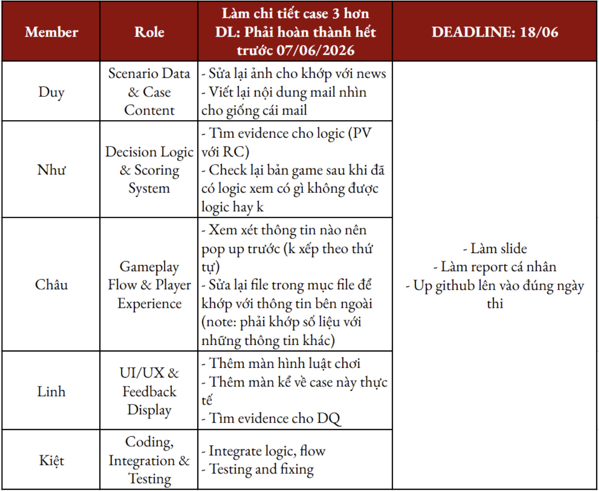

*Hình 1. Bảng phân công công việc của nhóm, trong đó phần của em là Coding, Integration & Testing.*

# 1. Vai trò của em trong dự án

Phần việc của em là biến ý tưởng và tài liệu của nhóm thành một prototype có thể chơi được trên web. Các bạn phụ trách content, logic quyết định, scoring, flow, UI/UX và feedback display; phần của em nằm ở bước tích hợp cuối cùng. Nếu tích hợp không đúng, nội dung tốt hoặc giao diện đẹp cũng không thể hiện đúng trong game.

Trong quá trình làm, em phụ trách chính app.js và các phần liên quan đến index.html, style.css, thư mục asset. Em cần đảm bảo người chơi đi đúng luồng: vào game, chọn case, đọc tab, mở evidence, đưa ra quyết định, cập nhật danh mục, tính điểm và xem result/replay. Mỗi thay đổi mới đều phải kiểm tra format dữ liệu, vị trí trong game và file ảnh/PDF đi kèm trước khi đưa vào code.

Điểm khó là game không được làm từ một file trống mà có nhiều bản sửa khác nhau. Có bản mạnh về giao diện, có bản có logic mới, có bản thêm ảnh/PDF hoặc sửa layout. Vì vậy em phải chọn phần cần giữ, phần cần thay và merge sao cho không làm hỏng các phần còn lại.

# 2. Vì sao phần integration là cần thiết

Nếu tách riêng, dự án có thể có content, scoring và giao diện tốt, nhưng sản phẩm cuối vẫn chưa dùng được nếu các phần không khớp. PDF có sẵn nhưng sai đường dẫn thì không mở được; Gmail content có trong sheet nhưng chưa map đúng phase thì người chơi đọc sai thông tin; scoring logic đã viết nhưng app.js vẫn dùng công thức cũ thì kết quả cuối không đúng thiết kế.

Vì vậy integration là bước biến tài liệu thành hành vi thật trong game. Khi người chơi bấm News, Gmail, Chat, Files hoặc chọn Option A/B/C/D, nội dung, allocation, portfolio value và điểm PV/RC/DQ phải cập nhật đúng theo dữ liệu mà người chơi tạo ra trong suốt quá trình chơi.

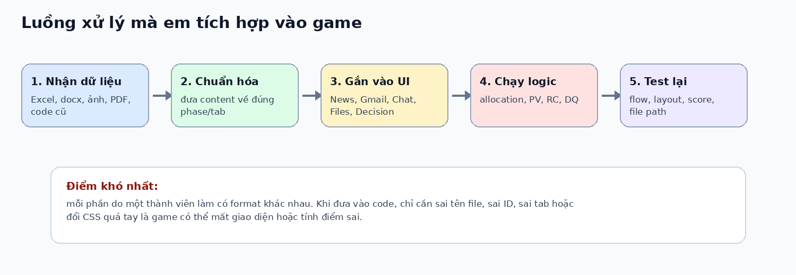

*Hình 2. Luồng công việc em xử lý khi đưa dữ liệu, logic và giao diện vào một bản game hoàn chỉnh.*

# 3. Những phần việc cụ thể em đã làm

Trong phần công việc cụ thể, em đặt coding foundation lên đầu vì đây là nền của toàn bộ game. Trước khi gộp content, ảnh, PDF hay scoring logic, em phải xây khung code ổn định: có màn hình, gameState, render engine, event handlers và cấu trúc dữ liệu để các phần của nhóm có thể cắm vào.

## 3.1 Xây dựng nền móng code và engine vận hành game

Phần xây nền móng code là nhiệm vụ “coding” rõ nhất của em. Trước khi đưa content, PDF hay scoring logic vào game, em phải làm bộ khung gồm cấu trúc màn hình, ID/class để JavaScript gọi được, cách lưu trạng thái người chơi, cách render theo phase và cách decision tác động đến kết quả cuối.

Em tách game thành ba lớp chính để dễ kiểm soát. HTML giữ khung màn hình và container; CSS giữ font, layout, sidebar, dashboard và responsive; JavaScript giữ logic chuyển phase, mở tab, lưu state, cập nhật portfolio và tính điểm. Khi các lớp tách rõ, việc update và sửa lỗi dễ hơn.

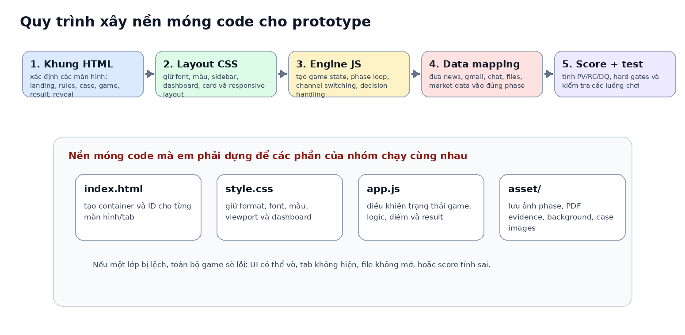

*Hình 3A. Quy trình em xây nền móng code trước khi đưa toàn bộ nội dung và logic vào game.*

### 3.1.1 Xác định cấu trúc màn hình và các điểm nối giữa HTML – CSS – JavaScript

Ở bước đầu, em xác định các màn hình chính: landing page, rules page, case page, game page, result page và reveal page. Sau đó em kiểm tra trong index.html xem từng màn hình, nút và vùng content đã có ID/container rõ ràng để JavaScript bắt sự kiện và render dữ liệu chưa.

Việc đặt đúng ID/class rất quan trọng. Nếu JavaScript gọi content-box nhưng HTML đổi thành main-content, thông tin sẽ không hiện; nếu next-phase-btn đổi tên, người chơi có thể chọn decision nhưng không qua phase tiếp theo. Vì vậy khi merge, em kiểm tra DOM hooks trước rồi mới sửa logic.

Với CSS, em không thay toàn bộ style để tránh làm hỏng phông chữ và layout của bản UI tốt nhất. Em chỉ chỉnh các phần cần thiết như viewport, icon sidebar, market-data card và vùng scroll trong từng tab.

| **Lớp code** | **Vai trò**                 | **Em cần kiểm tra gì?**                | **Nếu sai sẽ bị gì?**     |
|--------------|-----------------------------|----------------------------------------|---------------------------|
| HTML         | Khung màn hình và container | ID của page, button, tab, modal        | JS không tìm được element |
| CSS          | Format và trải nghiệm nhìn  | font, layout, scroll, card, responsive | vỡ giao diện, tràn chữ    |
| JavaScript   | Engine vận hành game        | state, phase, decision, scoring        | game chạy sai logic       |
| Asset        | Ảnh, PDF, background        | tên file, folder, path                 | ảnh/PDF không hiện        |

*Bảng 1. Cách em chia nền code thành các lớp để dễ kiểm tra và dễ tích hợp.*

### 3.1.2 Xây dựng gameState làm bộ nhớ trung tâm của game

GameState là bộ nhớ trung tâm của game. Em dùng nó để lưu phase hiện tại, portfolio value, research budget, allocation, file đã đọc, thời gian đọc từng nguồn, source engagement và decision log. Nhờ vậy game không mất thông tin khi người chơi đổi tab hoặc chuyển phase.

Ví dụ, khi người chơi mở evidence ở Phase 3, game phải biết file đó thuộc phase nào, tốn bao nhiêu RB, được đọc trong bao lâu và có phải critical/yellow file không. Các dữ liệu này được dùng lại khi tính ISQ và DQ, thay vì chỉ là thao tác giao diện.

Tương tự, khi người chơi chọn decision, gameState lưu PV trước/sau, allocation mới, option letter, phase return và các điểm RC/ISQ/EU/BC/BU nếu có. Nhờ đó result screen có decision replay và điểm cuối phản ánh cả quá trình chơi.

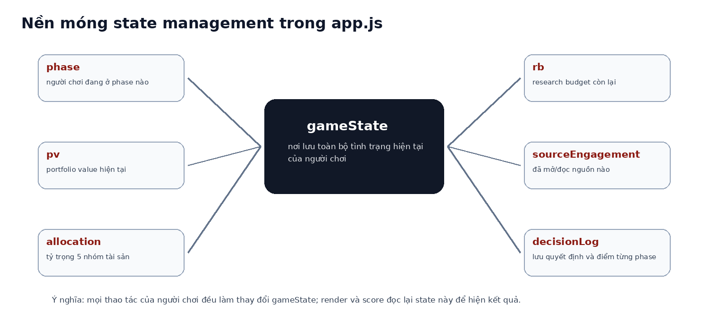

*Hình 3B. gameState là nơi em lưu toàn bộ trạng thái của người chơi, giúp game có tính liên tục giữa các phase.*

### 3.1.3 Chuẩn hóa dữ liệu phase để các phần của nhóm có thể cắm vào code

Một việc nền tảng khác là chuẩn hóa cách game đọc dữ liệu. Thay vì viết news hoặc email trực tiếp trong HTML, em đưa nội dung vào phase data. Mỗi phase dùng cùng cấu trúc: marketData, news, posts, emails, chats, files, decisionPrompt và options.

Cách này giúp cập nhật nội dung nhanh hơn. Khi nhóm gửi thêm news, email, flow, file evidence hoặc scoring rubric, em chỉ sửa đúng phần data hoặc engine liên quan thay vì phải chỉnh lại toàn bộ layout.

Đây cũng là cách giúp game dễ mở rộng. Nếu sau này thêm case mới, nhóm chỉ cần đưa dữ liệu theo cùng cấu trúc; sidebar, dashboard, render function, decision engine và result screen vẫn dùng lại được.

### 3.1.4 Tạo các hàm render và event handler để game phản hồi theo hành động người chơi

Sau khi có state và phase data, em xây các hàm render để đưa dữ liệu lên giao diện. Khi bấm News, Gmail, Files hoặc Decision, game sẽ render đúng nội dung tương ứng. Các hàm này dùng chung cho 6 phase để tránh viết lại giao diện nhiều lần.

Bên cạnh render, em xử lý event handler: bấm file thì kiểm tra RB, trừ RB, mở PDF modal và tính thời gian đọc; đổi tab thì cập nhật thời gian; chọn option thì lưu quyết định; bấm continue mới áp dụng allocation change và phase return.

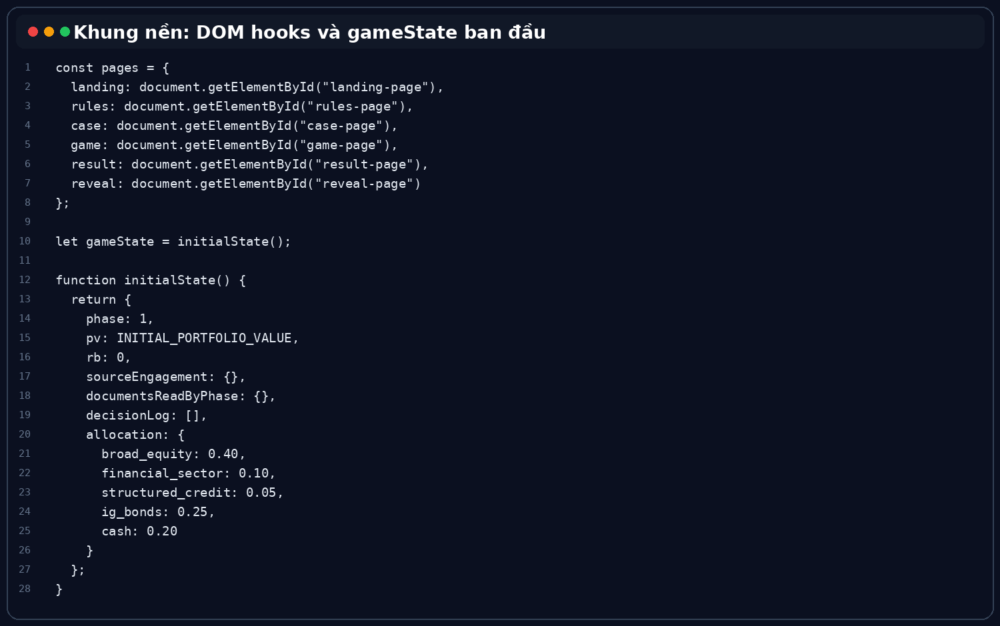

*Hình 3C. Đoạn code nền gồm DOM hooks và initialState, là điểm nối giữa giao diện và engine logic.*

### 3.1.5 Vì sao phần nền móng code này quan trọng với vai trò của em

Nền móng code không phải phần dễ nhìn nhất trên giao diện, nhưng quyết định game có ổn định không. Nếu chỉ thêm nội dung mà thiếu state và render structure, game sẽ giống một trang thông tin hơn là simulation vì quyết định của người chơi không tạo hệ quả rõ ràng.

Nhờ nền code này, các phần sau mới chạy được: information release 3 giây, RB carry-over, file preview 1 RB/2 RB, reading-time/skim logic, allocation update, PV compounding, RC path, DQ sub-scores, hard gates và decision replay.

Tóm lại, em cần một bộ khung đủ ổn để chịu nhiều lần cập nhật. Mỗi lần nhóm gửi logic hoặc file mới, em đưa vào đúng vị trí rồi test lại, từ đó hạn chế lỗi phát sinh và giữ bản cuối thống nhất cả giao diện lẫn logic.

## 3.2 Chuẩn bị codebase và gộp nhiều phiên bản code

Nhóm có nhiều bản code trong quá trình làm: bản giữ layout/font tốt, bản có logic mới, bản thêm ảnh hoặc evidence. Khi nhận bản mới, em không copy đè toàn bộ mà kiểm tra folder, class/id trong index.html, style.css và app.js để quyết định phần nào cần merge.

Các lỗi thường gặp là ID/class trong HTML không khớp với JavaScript, khiến button hoặc tab không chạy, và asset path bị lệch khiến ảnh/PDF không hiện. Những lỗi này không khó về thuật toán nhưng mất thời gian vì phải kiểm tra từng phase và từng tab.

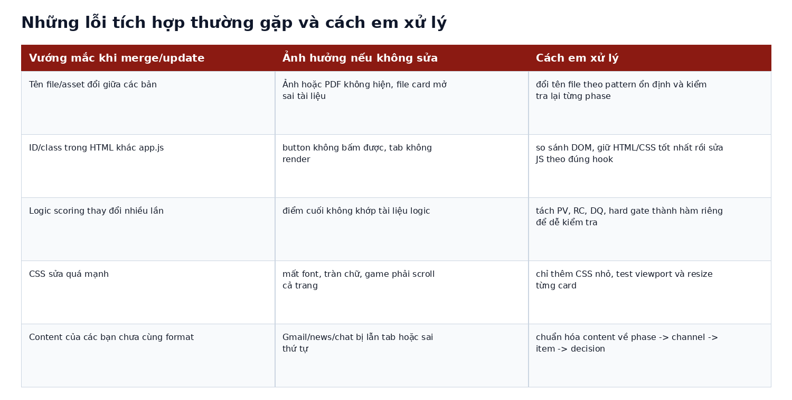

*Hình 3. Các vấn đề em thường gặp khi gộp code và cách em xử lý để không làm vỡ bản game.*

## 3.3 Đưa content của các bạn vào đúng phase và đúng tab

Sau khi nhóm hoàn thiện nội dung case, em đưa dữ liệu vào đúng cấu trúc game đọc được. Mỗi phase có News, Social/Internet, Gmail, Chat, Files, Market Data và Decision; nếu không chuẩn hóa, nội dung rất dễ bị lẫn giữa tab hoặc phase.

Ví dụ, Phase 1 phải có đúng news, Gmail, file evidence, cost RB và preview ngắn của Phase 1. Ở Phase 4–5, tín hiệu rủi ro rõ hơn nên em phải kiểm tra thứ tự thông tin để player không thấy bằng chứng quá lộ trên card nhưng vẫn đọc được evidence sâu trong PDF.

File card preview cũng được rút gọn. Card chỉ giữ title, type, cost/label và preview ngắn; bảng chi tiết, footnote, số liệu và warning evidence nằm trong PDF. Cách này giữ game công bằng hơn vì người chơi phải dùng Research Budget để đọc sâu.

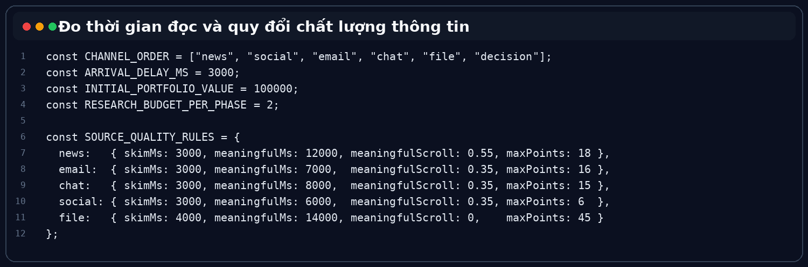

*Hình 4. Một phần code dùng để đo thời gian đọc và quy đổi mức độ đọc thông tin.*

## 3.4 Tích hợp luồng chơi theo từng phase

Em chỉnh luồng chơi để thông tin không hiện cùng lúc. Các tab mở dần theo thứ tự News, Social/Internet, Gmail, Chat, Files và Decision. Thời gian hiện thông tin được chỉnh xuống 3 giây để game không quá chậm nhưng vẫn có cảm giác thông tin đến theo lớp.

Luồng này giúp game mô phỏng việc ra quyết định khi thông tin chưa đầy đủ. Người chơi phải theo dõi nhiều nguồn, cân nhắc đọc sâu hay quyết định nhanh; hành vi đọc đó sau đó được phản ánh trong điểm DQ.

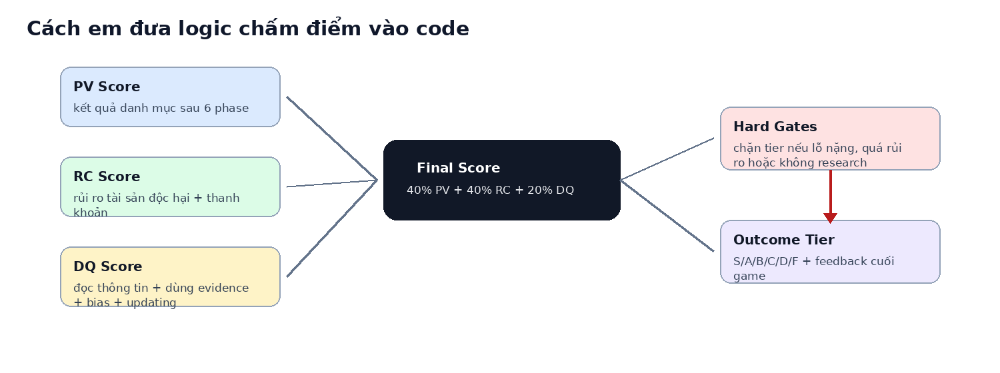

*Hình 5. Cấu trúc điểm cuối mà em đưa vào code: PV, RC, DQ và Hard Gates.*

## 3.5 Tích hợp decision engine và cập nhật portfolio

Mỗi phase có bốn lựa chọn A, B, C, D, mỗi lựa chọn đi kèm allocation change. Khi người chơi chọn option, code cập nhật tỷ trọng tài sản, tính phase return, cập nhật portfolio value và lưu decision log để cuối game replay từng phase.

Game có tính path-dependent: quyết định ở phase trước ảnh hưởng allocation ở phase sau, từ đó ảnh hưởng lãi/lỗ ở Phase 4–6. Vì vậy em phải kiểm tra sau mỗi decision xem allocation, PV và decision log có cập nhật đúng không.

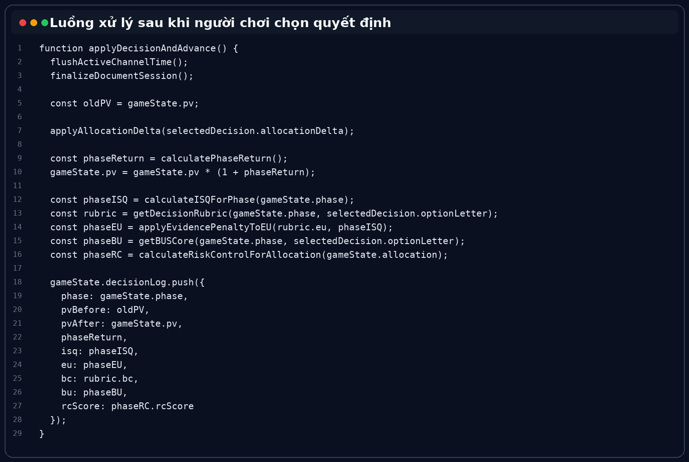

*Hình 6. Đoạn code xử lý sau khi người chơi chọn decision: cập nhật allocation, PV và log điểm theo phase.*

# 4. Phần scoring engine em đã tích hợp

Logic mới nhất của nhóm yêu cầu điểm cuối không chỉ dựa vào lãi/lỗ. Em tích hợp ba phần chính vào result engine: Portfolio Value (PV), Risk Control (RC) và Decision Quality (DQ), cùng Hard Gates để giới hạn tier nếu quản trị rủi ro quá yếu.

PV Score đo kết quả tài chính cuối cùng. RC Score đo mức kiểm soát rủi ro, đặc biệt với Structured Credit, Financial Sector và defensive liquid assets. DQ Score đo quá trình ra quyết định: đọc thông tin, dùng evidence, tránh FOMO/panic/confirmation bias và cập nhật niềm tin khi crisis evidence xấu dần.

Điểm khó là scoring gồm nhiều lớp: ISQ từ hành vi đọc, EU từ option, BC từ bias rubric, BU từ decision transition matrix và RC theo từng phase. Chỉ cần sai một phần nhỏ, final score có thể lệch so với logic document.

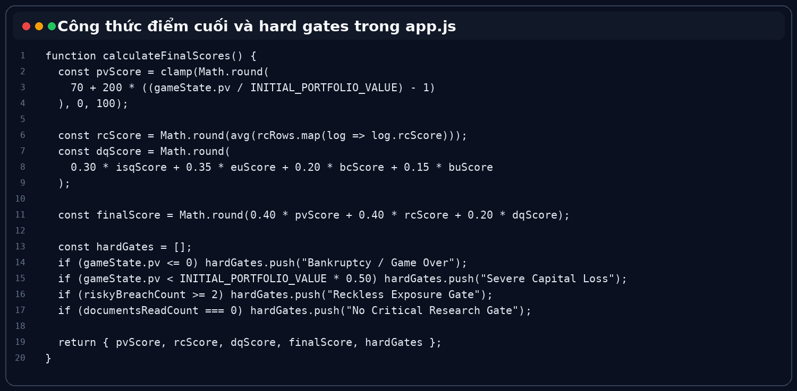

*Hình 7. Đoạn code tính điểm cuối và kiểm tra hard gates.*

# 5. Những phần UI/UX em đã sửa trong quá trình test

Sau khi logic chạy được, em tiếp tục test giao diện vì demo sẽ kém nếu game khó thao tác. Lỗi ban đầu là toàn bộ trang bị scroll, khiến người chơi phải kéo xuống mới thấy icon hoặc dashboard. Em chỉnh game nằm trong một viewport, icon bên trái ở giữa sidebar và chỉ phần nội dung trong tab được scroll.

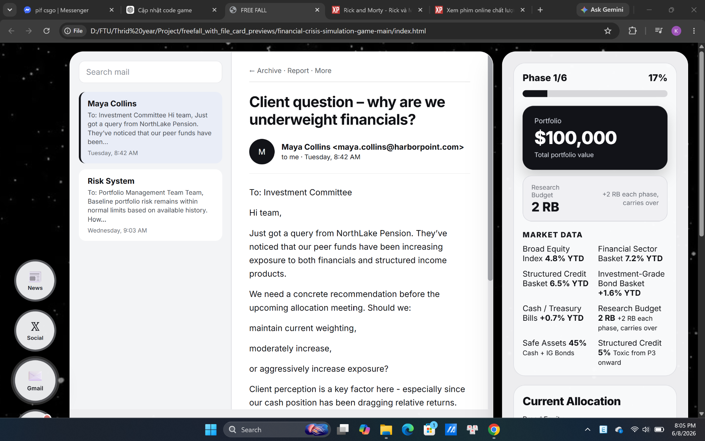

*Hình 8. Giao diện gameplay sau khi chỉnh viewport: icon bên trái nằm giữa, nội dung chính và dashboard được giữ trong một màn hình.*

Market Data cũng bị lặp thông tin và một số card bị kéo quá dài. Em sửa để chỉ hiển thị các chỉ số chính, không lặp Research Budget hoặc Safe Assets; đồng thời chỉnh layout để card thứ 5 không full-width và resize font ở các phase có số liệu hai chữ số như -22.5% YTD hoặc -38.0% YTD.

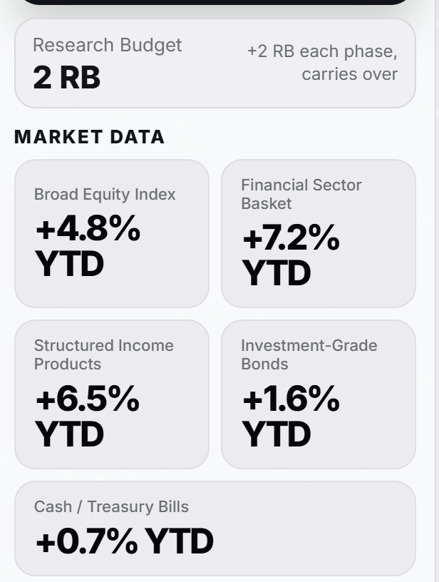

*Hình 9. Lỗi font Market Data bị tràn khi label hoặc số liệu quá dài.*

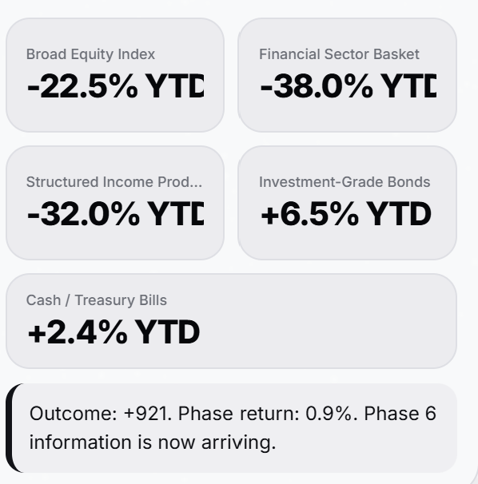

*Hình 10. Trường hợp double-digit return cần resize font để không tràn khỏi card.*

# 6. Testing và sửa lỗi sau khi tích hợp

Testing được làm sau mỗi lần merge vì chỉ một thay đổi nhỏ cũng có thể làm hỏng tab hoặc giao diện. Em kiểm tra toàn bộ flow: mở game, Start/Play case, xem tab, mở PDF, chọn decision, sang phase tiếp theo, kiểm tra PV/allocation và chạy đến result screen.

Một lỗi rõ nhất là mở game trực tiếp trong ZIP hoặc thư mục tạm của Windows khiến CSS và asset không load, giao diện hiện như HTML thô. Em ghi nhận và chuẩn bị hướng dẫn: phải giải nén toàn bộ folder trước khi mở index.html hoặc chạy bằng Live Server.

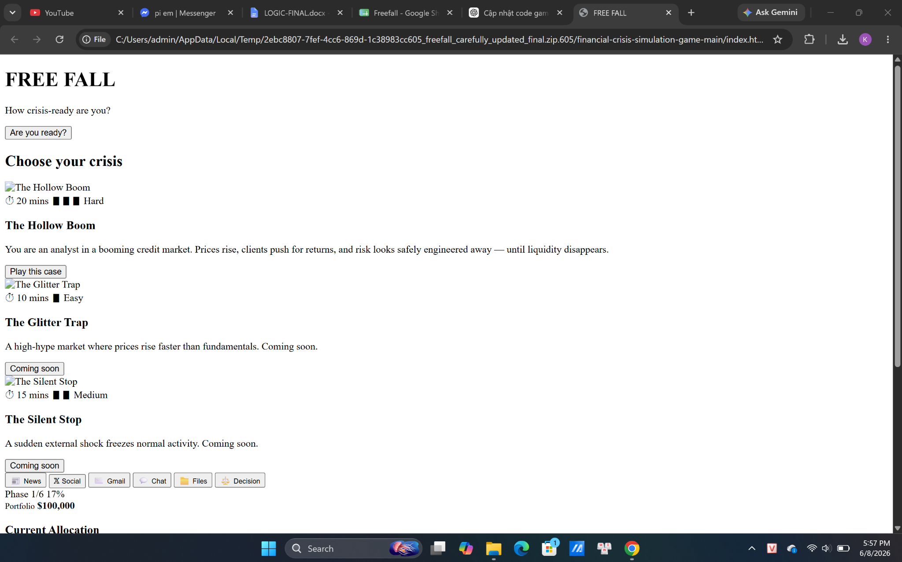

*Hình 11. Lỗi khi mở game trong ZIP/temp folder: CSS và asset không load nên giao diện hiện như HTML thô.*

Ngoài giao diện, em test Research Budget, file cost 1 RB/2 RB, allocation, PV, DQ, hard gates và decision replay. Mục tiêu là đảm bảo người chơi hiểu được vì sao mình nhận kết quả cuối cùng.

| **Hạng mục test**         | **Mục tiêu kiểm tra**                | **Cách em xử lý khi lỗi**               |
|---------------------------|--------------------------------------|-----------------------------------------|
| Start / Play case         | Game vào đúng màn hình chính         | kiểm tra button id và page switching    |
| Tab News/Gmail/Chat/Files | Nội dung hiện đúng phase             | so lại content theo phase và channel    |
| PDF evidence              | Mở đúng file và trừ RB đúng          | sửa file path, cost và important flag   |
| Decision option           | Allocation và PV cập nhật đúng       | test A/B/C/D qua nhiều phase            |
| Result screen             | Hiện PV/RC/DQ, hard gates, replay    | kiểm tra decisionLog và score functions |
| Viewport/UI               | Không scroll cả page, không tràn chữ | chỉnh CSS có kiểm soát và render lại    |

# 7. Khó khăn lớn nhất: cập nhật và gộp công việc của người khác vào code

Khó khăn lớn nhất không nằm ở một hàm cụ thể mà ở việc dự án thay đổi liên tục. Mỗi thành viên gửi phần việc ở format khác nhau như Excel, docx, ảnh/PDF hoặc một bản code mới. Em phải nối các phần đó thành một cấu trúc thống nhất trong game.

Ví dụ, nếu content đổi tên asset nhưng logic vẫn dùng key cũ, em phải tạo mapping để hai cách gọi dẫn về cùng asset. Nếu evidence đổi tên hoặc UI sửa class mà JS vẫn gọi tên cũ, game chỉ lộ lỗi khi chạy từng bước.

Em không merge máy móc. Trước khi sửa, em xác định bản giữ format chính, bản giữ logic mới và bản chứa asset/content mới. Sau đó em đưa vào theo thứ tự: assets, content, scoring logic rồi UI fix; sau mỗi nhóm thay đổi đều test lại.

Em cũng tách logic trong app.js thành các phần rõ ràng như RC, ISQ, DQ và hard gates. Khi logic document đổi, em có thể sửa đúng khu vực thay vì dò toàn bộ file. Với UI, em chỉ thêm CSS nhỏ ở khu vực cần chỉnh để tránh mất font hoặc layout chính.

Bài học lớn là integration không phải bước phụ. Nếu thiếu integration tốt, dự án nhóm dễ rơi vào tình trạng từng phần đều ổn nhưng bản cuối không chạy đúng. Vai trò của em là giữ sự nhất quán giữa nội dung, logic, giao diện và trải nghiệm người chơi.

# 8. Minh chứng có thể kiểm tra

- File app.js cuối cùng: có phase progression, information release, source engagement tracking, decision processing, portfolio update, scoring engine và hard gates.

- Folder game cuối cùng: gồm index.html, style.css, app.js, ảnh phase, background, PDF evidence và case images.

- Game chạy được từ landing page đến result page, có thể demo toàn bộ flow 6 phase.

- Result screen có score breakdown PV/RC/DQ và decision replay theo từng phase.

- File card preview đã được rút gọn, không show sẵn warning evidence quá lộ.

- Giao diện đã được chỉnh để không scroll cả page và icon bên trái nằm giữa sidebar.

- Market Data đã được sửa để không lặp thông tin và không bị tràn chữ trong các phase có return hai chữ số.

- Lịch sử các bản ZIP/GitHub có thể dùng để chứng minh quá trình cập nhật và merge nhiều lần.

Link GitHub / folder submission cuối cùng: \[điền link nhóm vào đây\].

Link commit hoặc bản ZIP quan trọng: \[điền link vào đây\].

# 9. Em học được gì từ phần việc này

Qua phần việc này, em hiểu rằng game mô phỏng tài chính không chỉ cần nội dung đúng; nội dung phải được chuyển thành hành vi trong game. Người chơi phải thấy thông tin đúng lúc, đưa ra quyết định, thấy danh mục thay đổi và nhận feedback hợp lý.

Em cũng học cách làm việc với codebase thay đổi liên tục. Khi nhiều người cùng sửa, cần xác định source of truth, asset mới và logic mới trước khi tích hợp. Test sau từng thay đổi nhỏ giúp phát hiện lỗi nhanh hơn và tránh lỗi chồng lên nhau ở cuối.

Cuối cùng, UX cũng là một phần của testing. Game chạy đúng nhưng chữ tràn, card quá dài, phải scroll nhiều hoặc icon khó bấm thì demo vẫn chưa tốt. Vì vậy em phải nhìn sản phẩm như người chơi thật chứ không chỉ như người viết code.

# 10. Gợi ý cho nhóm hoặc khóa sau nếu phát triển tiếp

- Nên có một file dữ liệu chính cho scenario content để tránh mỗi người dùng một format khác nhau.

- Nên thống nhất tên asset, tên phase, tên option và tên asset class ngay từ đầu để code dễ map hơn.

- Nên dùng GitHub thường xuyên hơn, mỗi thay đổi lớn nên có commit riêng để dễ kiểm tra lỗi phát sinh từ đâu.

- Nên tách content ra JSON hoặc file dữ liệu riêng thay vì hard-code quá nhiều trong app.js.

- Nên test với người ngoài nhóm để xem họ có hiểu tab, file evidence, quyết định và result feedback không.

- Nên giữ một checklist demo cuối cùng: mở game, play case, đọc tab, mở file, chọn decision, xem result, kiểm tra layout.
