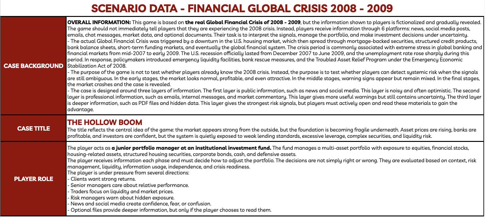
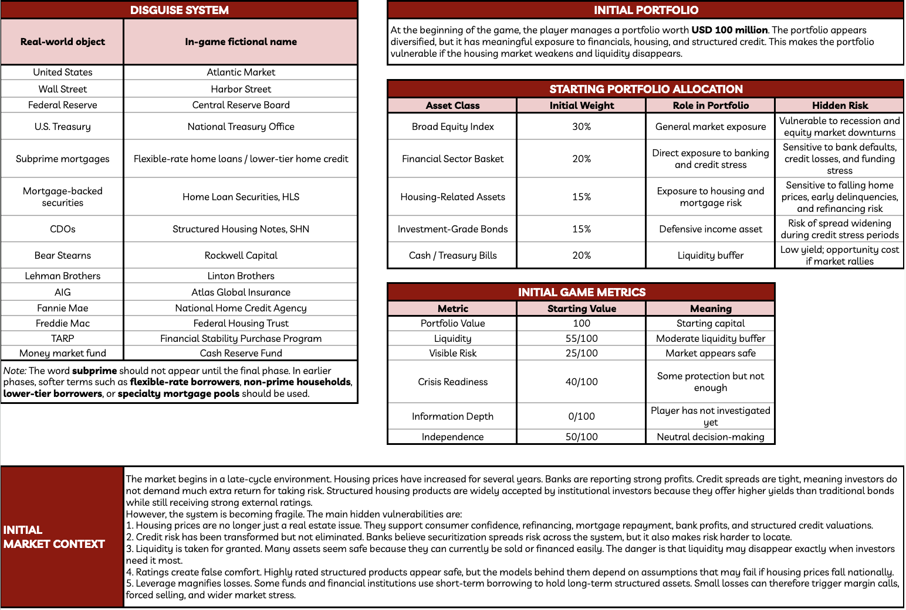
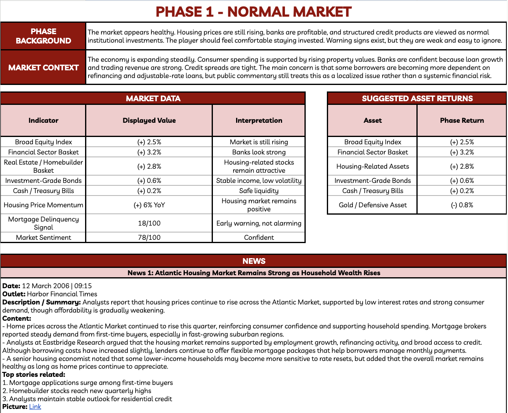
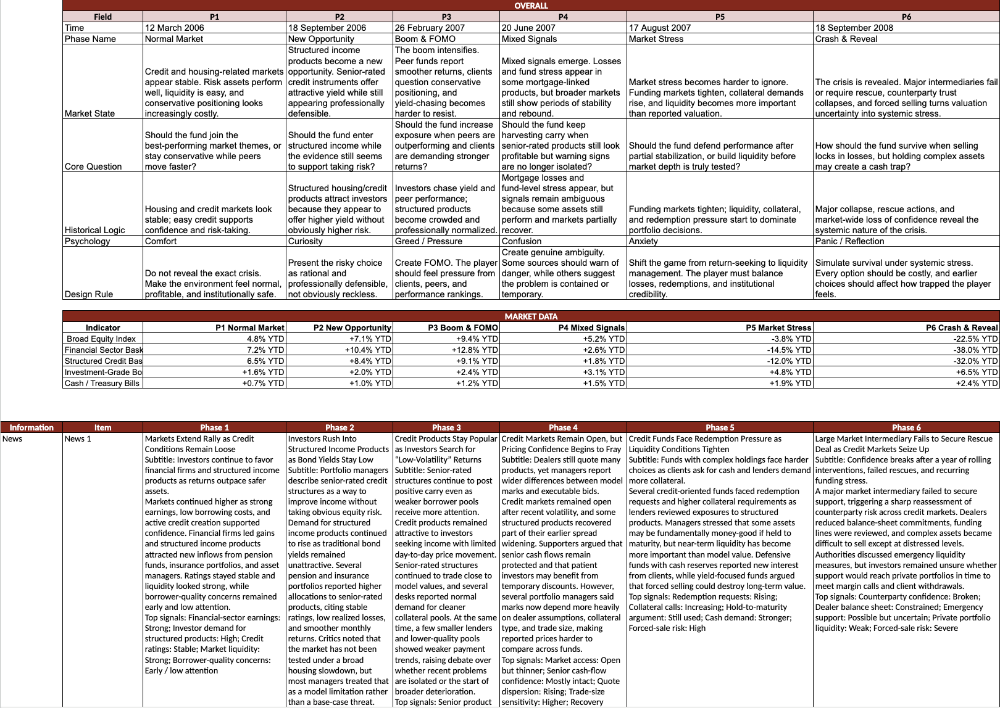
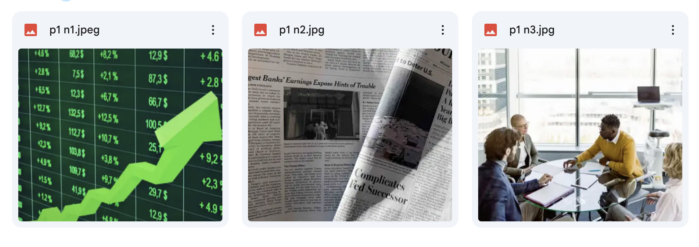
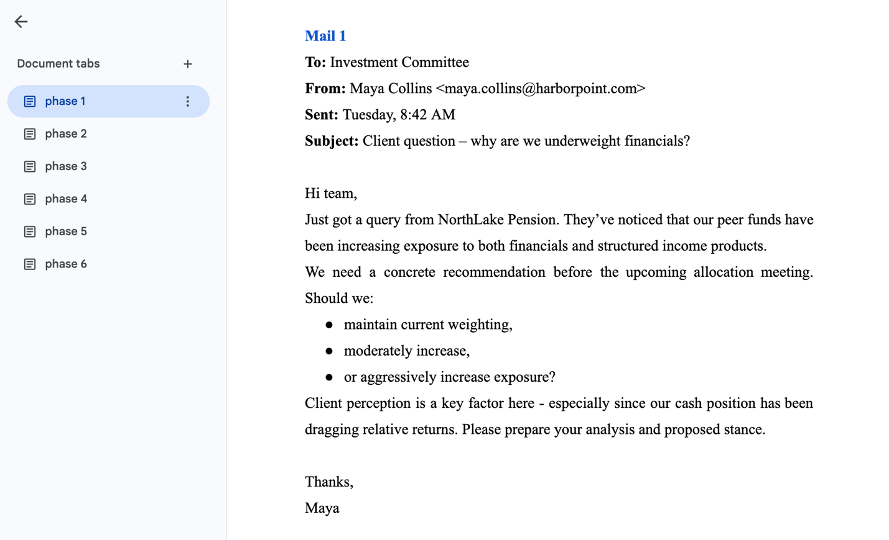
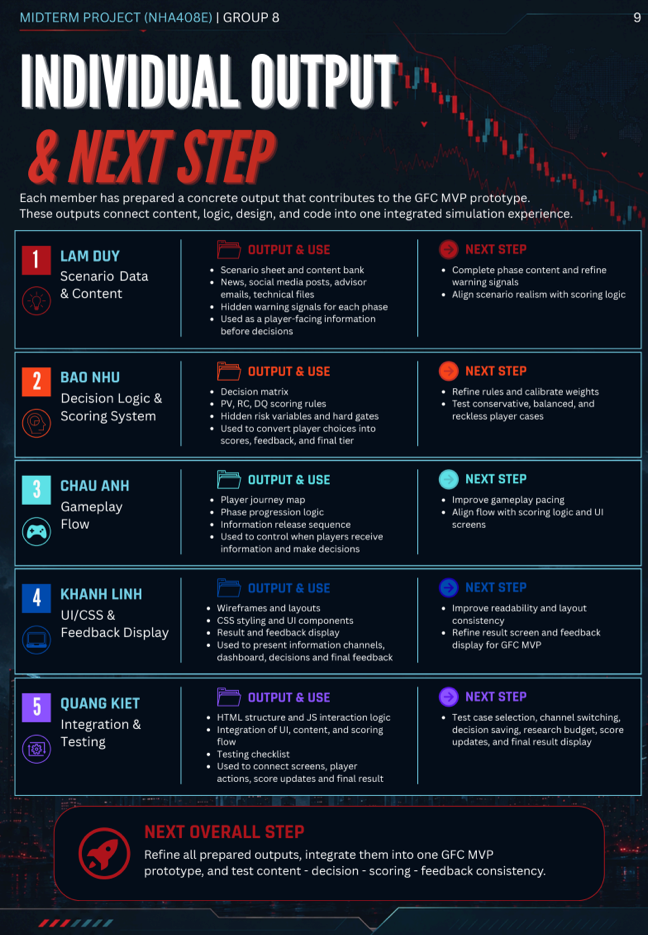
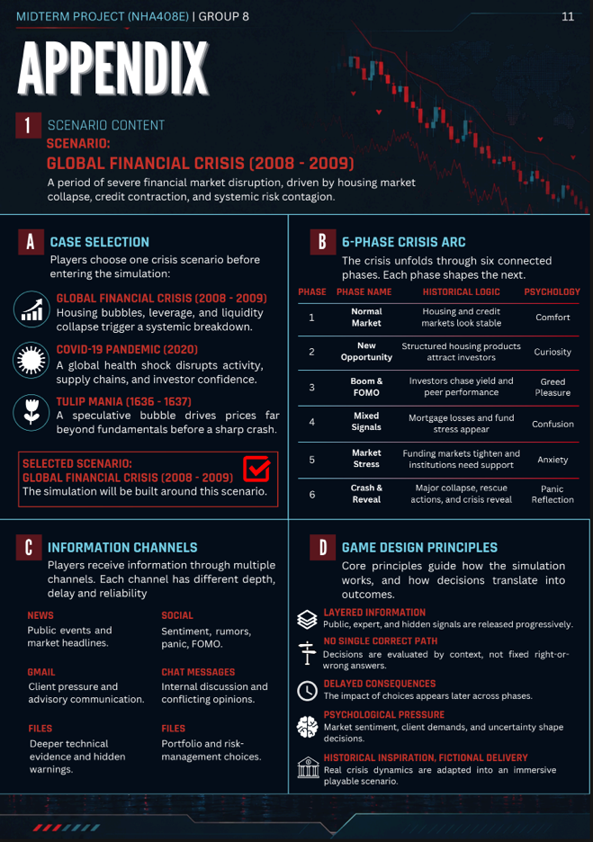

# INDIVIDUAL REPORT

**Họ và tên: Vũ Lam Duy**

**Mã sinh viên: 2312380807**

1.  **Vai trò trong dự án**

- Phụ trách: Scenario Data & Case Content

- Vai trò chính: Xây dựng nội dung sơ bộ scenario cho các phase, đảm bảo dữ liệu đầy đủ, có logic và liên quan gián tiếp đến Global Financial Crisis 2008 - 2009 (sửa lại nội dung để người chơi không biết thực tế case mô phỏng khủng hoảng tài chính có thật). Ngoài ra, các thông tin cung cấp cần trực quan và phù hợp với game simulation.

- Các công việc liên quan: tổng hợp từ nội dung thực tế và viết nội dung news, social media, email, chat, market state, share price movement, optional documents; chuẩn hóa data theo template; đảm bảo nội dung hợp lý để kết nối logic giữa các phase và tính chính xác cho decision screen.

2.  **Dấu ấn cá nhân trong sản phẩm**

Dấu ấn cá nhân của em được thể hiện rõ nhất qua việc xây dựng toàn bộ nội dung scenario cho 6 phase của game. Em chịu trách nhiệm viết bối cảnh từng phase, tổng hợp dữ liệu từ nhiều nguồn và xây dựng thành các news, social media, email/advisor, chat, market state, share price movements, và optional documents. Em cần biên tập lại, chuẩn hóa, và đảm bảo về mặt nội dung sơ bộ để sau đó kết nối logic giữa các phase, đưa ra phần nội dung hoàn chỉnh có sự liền mạch và dễ hiểu cho người chơi.

Phần scenario sheet, mail drafts, chat logs, và optional documents mà em xây dựng là nền tảng quan trọng để các phase vận hành chính xác, cung cấp đầy đủ thông tin cho người chơi đưa ra quyết định. Em cũng chịu trách nhiệm tạo các nội dung news, tổng hợp ảnh có liên quan tới nội dung news và mảng social media sao cho phản ánh tính chất thực tế của thị trường theo từng phase, đồng thời tăng tính tương tác, giúp người chơi phải tự phân tích dữ liệu, từ đó đưa ra quyết định phù hợp.

Ngoài ra, em cũng cần nghiên cứu thông tin thực tế về thị trường cũng như các giai đoạn khủng hoảng để có thể hiểu rõ hơn về tình trạng thị trường, xây dựng các nội dung sao cho sát với thực tế nhất có thể, song cần biến đổi để không để lộ thông tin thật về cuộc khủng hoảng tài chính.

3.  **Những việc đã thực sự làm**

- Trong suốt quá trình thực hiện dự án, em đã xây dựng nội dung tình huống và dữ liệu của từng phase. Em là người tổng hợp và viết sơ bộ bối cảnh, danh mục ban đầu, market context, dữ liệu giá, và các thông tin như news, social media, email/advisor, market state, share price movements, cũng như optional documents cho cả 6 phase của trò chơi. Mọi dữ liệu và thông tin đều cần có logic, dễ hiểu và gần gũi với người chơi, giúp họ có thể tự khám phá các tín hiệu, đánh giá rủi ro, và ra quyết định dựa trên các thông tin giả lập nhưng sát với thực tế.

- Ngoài ra, em đã định dạng các email và viết lại nội dung mail sao cho nhìn đồng nhất và chuyên nghiệp, đồng thời đảm bảo chúng phản ánh đúng bối cảnh của từng phase.

- Em cũng tìm và lựa chọn hình ảnh minh họa cho các news, đảm bảo mỗi news đều có visual representation trực quan, giúp người chơi dễ hình dung tình hình thị trường.

- Em còn góp phần thiết kế phần tiến độ công việc và phần công việc của bản thân trong báo cáo giữa kỳ.

4.  **File, tính năng, dữ liệu, logic, giao diện, tài liệu hoặc phần demo đã đóng góp**

- Data ban đầu: <https://bit.ly/databandau>

- Data final: <https://bit.ly/4ezEZbP>

- Ảnh cho news: <https://bit.ly/4uynoWL>

- Mail: <https://bit.ly/4xnTdUD>

5.  **Bằng chứng đóng góp**

<!-- -->

1)  *Data ban đầu*

2)  *Data final*

3)  *Ảnh cho news*

4)  *Mail*

5)  *Báo cáo giữa kỳ*

6.  **Phần đóng góp kết nối với sản phẩm cuối cùng**

Phần việc của em gắn liền trực tiếp với trải nghiệm người chơi trong game. Em chịu trách nhiệm tổng hợp dữ liệu cho từng phase, viết news, email, chat, social media, và optional documents, giúp game có đầy đủ thông tin để người chơi đưa ra quyết định. Nhờ có những nội dung này, trò chơi có bối cảnh rõ ràng, logic vận hành trơn, và người chơi có thể tự theo dõi diễn biến thị trường, biến động giá, cũng như phản hồi từ các kênh thông tin mà không cần giải thích từng bước.

Ngoài ra, em còn tham gia định dạng mail, tìm hình ảnh minh họa cho các news, và góp ý thiết kế báo cáo giữa kỳ. Những việc này làm sản phẩm cuối trực quan hơn, dễ nhìn và người chơi có thể dễ dàng nắm bắt thông tin. Nhờ vậy, game vừa chân thực, vừa logic, người chơi trải qua toàn bộ 6 phase: từ thị trường bình thường, cơ hội mới, FOMO, mixed signals, market stress cho đến crash & reveal, đồng thời cảm nhận được các áp lực tâm lý khi đưa ra quyết định.

7.  **Điều cá nhân học được**

Trong quá trình thực hiện dự án, em học được cách tổng hợp dữ liệu từ nhiều nguồn khác nhau để chọn lọc và chuyển thông tin thành các news, emails, chat, và optional documents. Các thông tin được kiểm duyệt nhằm xác định tính hơp lý để xây dựng logic cho từng scenario một cách mạch lạc và có hệ thống. Em cũng nâng cao được kỹ năng viết nội dung học thuật nhưng trực quan, dễ hiểu, giúp người chơi nắm bắt thông tin mà không bị rối hay quá tải. Việc mô phỏng phản ứng thị trường thực tế giúp em hiểu được cách thể hiện thông tin phức tạp thành dữ liệu “game-ready”, từ đó làm nội dung rõ ràng, sinh động và hỗ trợ việc chơi game hiệu quả.

Bên cạnh đó, việc quản lý tiến độ công việc theo timeline và theo sát từng phase giúp em rèn kỹ năng ưu tiên công việc, đảm bảo các thông tin quan trọng được hoàn thiện đúng tiến độ và chất lượng. Em nhận ra làm sản phẩm nhóm không chỉ là chia việc, mà còn là kết nối các phần với nhau: dữ liệu, logic, nội dung, hình ảnh, và thiết kế đều phải gắn kết, hỗ trợ nhau để tạo ra sản phẩm cuối cùng đồng bộ và trọn vẹn. Quá trình này cũng giúp em hiểu rõ hơn tầm quan trọng của giao tiếp, phối hợp nhóm, và khả năng nhìn tổng thể để đưa ra quyết định hợp lý, cân bằng giữa chất lượng, tiến độ và tính khả thi của sản phẩm.

Ngoài ra, em học được cách đánh giá và kiểm tra chéo các nguồn thông tin, từ đó nâng cao sự cẩn trọng và tư duy phản biện trong việc xây dựng kịch bản, đồng thời phát triển khả năng giải quyết vấn đề khi gặp các dữ liệu mâu thuẫn hoặc thiếu sót. Em cũng học được thêm sự tỉ mỉ trong việc chuẩn bị nội dung và kiểm soát thông tin để tối ưu hóa trải nghiệm người chơi, giúp sản phẩm cuối cùng đạt hiệu quả giáo dục và tương tác cao nhất có thể.

8.  **Khó khăn gặp phải và cách xử lý**

**(1) Khó khăn trong việc chọn lọc và chuẩn hóa thông tin**

- *Vấn đề:* Phạm vi thông tin về case thực tế quá rộng, trong khi đó em cần tổng hợp từ nhiều nguồn dữ liệu khác nhau để xác thực. Nếu không chọn lọc và chuẩn hóa, người chơi sẽ bị quá tải thông tin hoặc dữ liệu không nhất quán giữa các phase.

- *Cách xử lý:* Em chọn lọc thông tin và tạo template cố định cho từng phase, định dạng tất cả các nguồn theo cùng một chuẩn: highlight key metrics, thông tin quan trọng, và các dữ liệu optional. Nhờ vậy, trải nghiệm người chơi được tối ưu, họ dễ theo dõi tiến trình, và thông tin giữa các phase luôn liên kết chặt chẽ.

**(2) Khó khăn trong việc đảm bảo liên kết thông tin giữa các phase**

- *Vấn đề:* Mỗi phase có dữ liệu và câu chuyện riêng, nếu không đồng bộ, logic game sẽ bị gián đoạn.

- *Cách xử lý:* Em rà soát toàn bộ thông tin, đảm bảo các tín hiệu từ phase trước được phản ánh đúng trong phase tiếp theo. Các dữ liệu được kiểm tra và chỉnh sửa để phù hợp với nội dung từng phase, giữ mạch câu chuyện thống nhất.

**(3) Khó khăn trong việc lên nội dung file optional documents**

- *Vấn đề:* Optional documents cần vừa đủ thông tin để người chơi tìm ra insight, vừa không tiết lộ quá nhiều. Nếu quá chi tiết, game sẽ mất thử thách; nếu quá sơ sài, người chơi khó đưa ra quyết định.

- *Cách xử lý:* Em thiết kế nội dung từng file optional documents dựa trên template, highlight dữ liệu quan trọng, sắp xếp trực quan. Em kiểm tra mỗi file để đảm bảo các con số, news, và tín hiệu đều khớp với phần scenario logic, tạo sự tương thích cao với gameplay.

**(4) Khó khăn trong quản lý tiến độ và tổng hợp dữ liệu nhiều nguồn**

- *Vấn đề:* Dữ liệu đa dạng, nhiều file, dễ gây trễ tiến độ hoặc thông tin chồng chéo.

- *Cách xử lý:* Em lập timeline chi tiết để hoàn thành đúng tiến độ công việc cá nhân và đảm bảo các phần liên quan được cập nhật kịp thời.

9.  **Lời nhắn cho sinh viên khóa sau**

Em muốn nhắn nhủ các bạn rằng làm dự án nhóm không chỉ là chia việc xong mỗi người làm phần của mình mà còn là cách kết nối các phần với nhau để tạo ra một sản phẩm thống nhất. Khi làm scenario và xây dựng dữ liệu cho từng phase, các bạn sẽ phải tổng hợp thông tin từ rất nhiều nguồn khác nhau để tạo thành các news, email, chat messages, file technical, optional documents. Điều quan trọng là luôn kiểm soát được mạch logic, đảm bảo thông tin giữa các phase liên kết với nhau.

Đừng ngại đặt câu hỏi và thảo luận với các thành viên khác khi gặp khó khăn, hoặc khi thấy dữ liệu chưa thống nhất. Hãy tạo thói quen kiểm tra kỹ các file, định dạng nội dung theo template cố định và luôn suy nghĩ xem người chơi sẽ nhìn nhận thông tin như thế nào. Việc này giúp sản phẩm cuối cùng trực quan, dễ hiểu và thú vị hơn cho người chơi.

Cuối cùng, hãy chủ động học hỏi cách trình bày thông tin phức tạp một cách trực quan, và chú ý timeline để đảm bảo tất cả phase hoàn chỉnh đúng hạn. Kỹ năng này sẽ rất hữu ích không chỉ cho dự án học thuật mà còn cho các tình huống thực tế về dữ liệu, phân tích và quản lý dự án sau này.

Các bạn hãy tận hưởng quá trình này, vì mỗi phase là một cơ hội để học cách mô phỏng phản ứng thị trường thực tế, làm việc nhóm hiệu quả, và xây dựng sản phẩm mang tính trải nghiệm thực tế cao.
